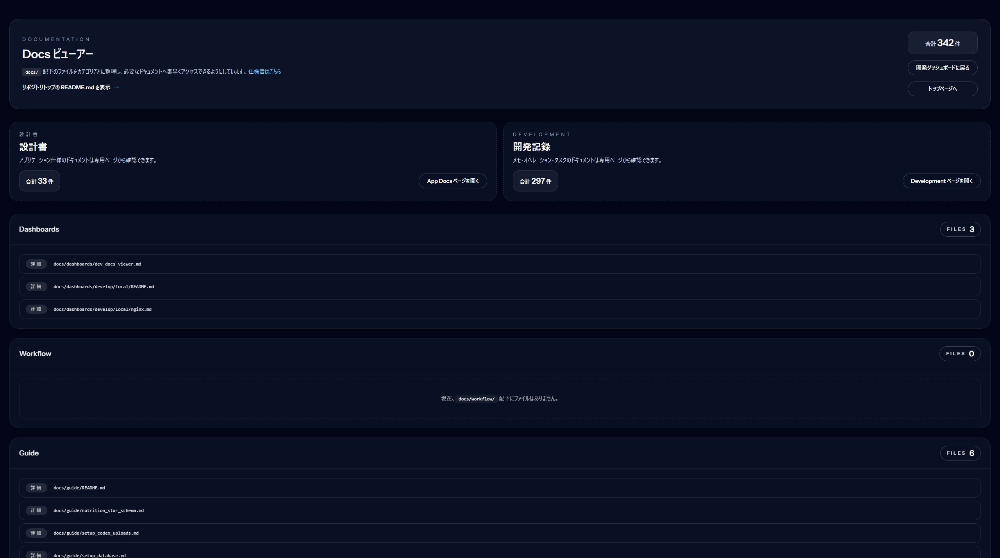

# orbit-docs-viewer (orbit-sys-dev/laravel-dev-docs-viewer)

英語版: [README.md](README.md)  
development 運用ガイド: [docs/guide/development_usage.md](docs/guide/development_usage.md)
設計書運用ガイド: [docs/guide/app_docs_usage.md](docs/guide/app_docs_usage.md)

ライセンス: [MIT](LICENSE) / [MIT 日本語版](LICENSE.ja.md)

コントリビューション: [CONTRIBUTING.md](CONTRIBUTING.md) / [CONTRIBUTING.ja.md](CONTRIBUTING.ja.md)

`docs/` 配下のドキュメントを閲覧するための Laravel 用プラグインです。orbit-ops の `/dev/docs` 画面をパッケージ化し、`composer require` だけで任意のプロジェクトに組み込めます。

## 画面サンプル



## 導入手順

1. インストール

```bash
composer require orbit-sys-dev/laravel-dev-docs-viewer
```

2. 設定ファイルの publish（必要に応じてビューも publish）

```bash
php artisan vendor:publish --tag=docs-viewer-config
php artisan vendor:publish --tag=docs-viewer-views   # レイアウトや翻訳を調整したい場合
```

3. `.env` 設定例

```env
DOCS_VIEWER_ROOT_DIR=docs
DOCS_VIEWER_APP_PATH=docs/app
DOCS_VIEWER_ROUTE_PREFIX=dev/docs
DOCS_VIEWER_ROUTE_NAME_PREFIX=dev.docs.
DOCS_VIEWER_MIDDLEWARE=web,auth
DOCS_VIEWER_LOCALE=ja
DOCS_VIEWER_AVAILABLE_LOCALES=ja,en
DOCS_VIEWER_LOCALE_QUERY=lang
DOCS_VIEWER_LAYOUT=docs-viewer::layouts.docs
DOCS_VIEWER_DASHBOARD_URL=/ops
DOCS_VIEWER_DASHBOARD_LABEL="開発ダッシュボードに戻る"
DOCS_VIEWER_HOME_URL=/
DOCS_VIEWER_HOME_LABEL="トップページへ"
```

4. `docs/` ディレクトリを配置

`docs/app`, `docs/development/{memo,operation,task}` などの構成を配置すると即利用できます。ブラウザで `/dev/docs` を開いて動作確認してください。

## ルーティング

デフォルト設定時のルートは次の通りです（prefix や middleware は config で変更可能）。

- `GET /dev/docs` → トップ (`dev.docs.viewer`)
- `GET /dev/docs/app` → 設計書一覧 (`dev.docs.app`)
- `GET /dev/docs/development` → Development カード (`dev.docs.development`)
- `GET /dev/docs/development/{group}` → Development グループ一覧 (`dev.docs.development.group`)
- `GET /dev/docs/file` → 単一ファイル表示 (`dev.docs.viewer.file`, `?path=...`)

## 設定の要点

- `root_dir`: ドキュメントルートの相対パス（デフォルト `docs`）
- `app_docs_path`: 設計書カテゴリのパス（ルートに付け足されます）
- `development_groups`: Development グループのラベル／パスを配列で定義
- `route.prefix` / `route.name_prefix` / `route.middleware`: ルートや middleware を切り替え
- `layout`: レイアウト Blade。デフォルトは同梱の簡易レイアウト。アプリ側レイアウトに寄生したい場合はここを差し替え。
- `dashboard_url`: 「開発ダッシュボードへ戻る」リンク先。不要なら null。
- `timezone`: 日付表示のタイムゾーン。未設定時は `config('app.timezone')` を利用。
- `locale` / `locales` / `locale_query_key`: 言語の初期値と URL パラメータ（デフォルト `lang`）を指定できます。`?lang=en` などで英語／日本語を切り替えられます。

## ライセンス

MIT
