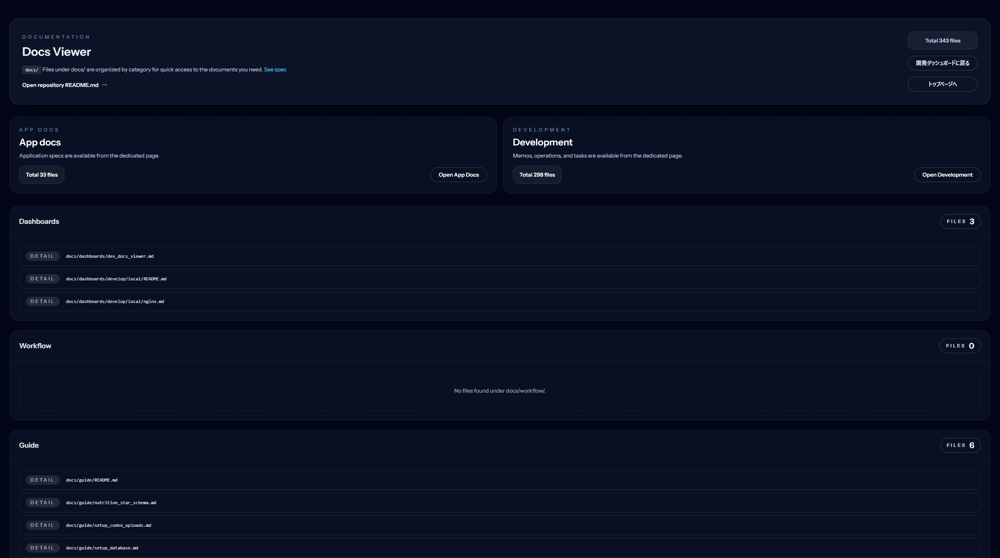

# orbit-docs-viewer (orbit-sys-dev/laravel-dev-docs-viewer)

Live site (GitHub Pages): [EN](https://orbit-sys-dev.github.io/orbit-docs-viewer/gh-pages/en/) / [JA](https://orbit-sys-dev.github.io/orbit-docs-viewer/gh-pages/)

Read in Japanese: [README.ja.md](README.ja.md)  
Development docs usage (JA): [docs/guide/development_usage.md](docs/guide/development_usage.md)
App docs usage (JA): [docs/guide/app_docs_usage.md](docs/guide/app_docs_usage.md)

License: [MIT](LICENSE) / [MIT (JA)](LICENSE.ja.md)

Contributing: [CONTRIBUTING.md](CONTRIBUTING.md) / [CONTRIBUTING.ja.md](CONTRIBUTING.ja.md)

Laravel plugin for browsing documents under `docs/`. It packages the orbit-ops `/dev/docs` screen so you can drop it into any project with a simple `composer require`.

## UI preview



## Installation

1. Install

```bash
composer require orbit-sys-dev/laravel-dev-docs-viewer
```

2. Publish config (and views if you want to customize layout/translations)

```bash
php artisan vendor:publish --tag=docs-viewer-config
php artisan vendor:publish --tag=docs-viewer-views   # when you want to tweak layout or translations
```

3. `.env` example

```env
DOCS_VIEWER_ROOT_DIR=docs
DOCS_VIEWER_APP_PATH=docs/app
DOCS_VIEWER_ROUTE_PREFIX=dev/docs
DOCS_VIEWER_ROUTE_NAME_PREFIX=dev.docs.
DOCS_VIEWER_MIDDLEWARE=web,auth
DOCS_VIEWER_LOCALE=ja
DOCS_VIEWER_AVAILABLE_LOCALES=ja,en
DOCS_VIEWER_LOCALE_QUERY=lang
DOCS_VIEWER_LAYOUT=docs-viewer::layouts.docs
DOCS_VIEWER_DASHBOARD_URL=/ops
DOCS_VIEWER_DASHBOARD_LABEL="Back to Dev Dashboard"
DOCS_VIEWER_HOME_URL=/
DOCS_VIEWER_HOME_LABEL="Back to Home"
```

4. Place your `docs/` directory

Drop in a structure such as `docs/app` and `docs/development/{memo,operation,task}` and you can use it immediately. Open `/dev/docs` in your browser to verify.

## Routing

Default routes (prefix and middleware are configurable):

- `GET /dev/docs` → Top (`dev.docs.viewer`)
- `GET /dev/docs/app` → App docs list (`dev.docs.app`)
- `GET /dev/docs/development` → Development cards (`dev.docs.development`)
- `GET /dev/docs/development/{group}` → Development group list (`dev.docs.development.group`)
- `GET /dev/docs/file` → Single file view (`dev.docs.viewer.file`, `?path=...`)

## Configuration notes

- `root_dir`: Relative path to the docs root (default `docs`)
- `app_docs_path`: Path for the App docs category (appended to the root)
- `development_groups`: Array of labels/paths for Development groups
- `route.prefix` / `route.name_prefix` / `route.middleware`: Switch routing and middleware
- `layout`: Layout Blade. Defaults to the bundled simple layout; override to use your app layout.
- `dashboard_url`: Target for “Back to Dev Dashboard”. Set null to hide.
- `timezone`: Timezone used for date display. Falls back to `config('app.timezone')` when unset.
- `locale` / `locales` / `locale_query_key`: Set default locale and the URL query key (default `lang`). Switch languages with `?lang=en`, etc.

## License

MIT
